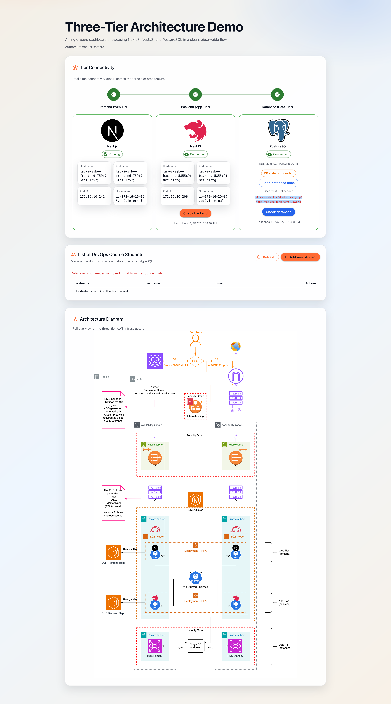
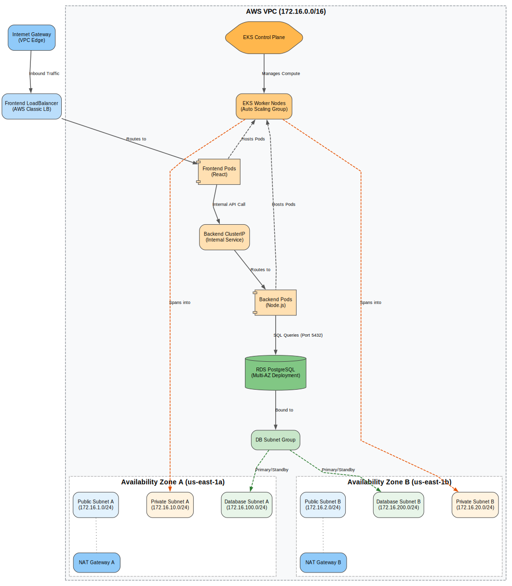

# AWS 3-Tier Architecture with EKS and RDS

This repository contains the Terraform configuration to deploy a secure and scalable 3-tier architecture on AWS. The infrastructure is designed to host a containerized application using Amazon Elastic Kubernetes Service (EKS) for the web and application tiers and Amazon RDS for the data tier.



## Architecture Overview

The infrastructure is distributed across two Availability Zones for high availability and follows a strictly segmented network design:

1. **Web Tier**: Managed by EKS, featuring a React frontend exposed via an AWS Classic Load Balancer.
2. **Application Tier**: Managed by EKS, featuring a Node.js/Prisma backend that communicates internally with the web tier and provides the logic for interacting with the database.
3. **Data Tier**: A Multi-AZ Amazon RDS PostgreSQL instance, isolated within private database subnets and accessible only by the application tier.

### Terraform Graph

This graph was generated with `terraform graph` and was modified with AI to enhance organization of the infrastructure.



## Project Structure

The project is organized into modular components for maintainability and reusability:

- `modules/networking`: Provisions the VPC, subnets (public, private, and database), NAT Gateways, and Internet Gateway.
- `modules/database`: Provisions the PostgreSQL RDS instance, security groups, and subnet groups.
- `modules/eks`: Provisions the EKS cluster, managed node groups, and IAM roles.
- `modules/kubernetes_workloads`: Deploys the application components (frontend and backend) onto the EKS cluster.
- `Dockerfiles/`: Contains the Dockerfiles used to build the backend and frontend container images.

## Prerequisites

- Terraform
- AWS CLI configured with appropriate permissions.
- kubectl configured to interact with the EKS cluster.

## Configuration

The project uses the following key variables and settings (defined in `variables.tf` and `locals.tf`):

- **Region**: `us-east-1` (default)
- **VPC CIDR**: `172.16.0.0/16`
- **EKS Version**: `1.30`
- **Database**: PostgreSQL 15.8 (Multi-AZ)
- **Node Instance Type**: `t3.small`

## Deployment

1. **Initialize Terraform**:

   ```bash
   terraform init
   ```
2. **Review the Plan**:

   ```bash
   terraform plan
   ```
3. **Apply the Infrastructure**:

   ```bash
   terraform apply
   ```

## Cleanup

To destroy all provisioned resources:

```bash
terraform destroy
```
